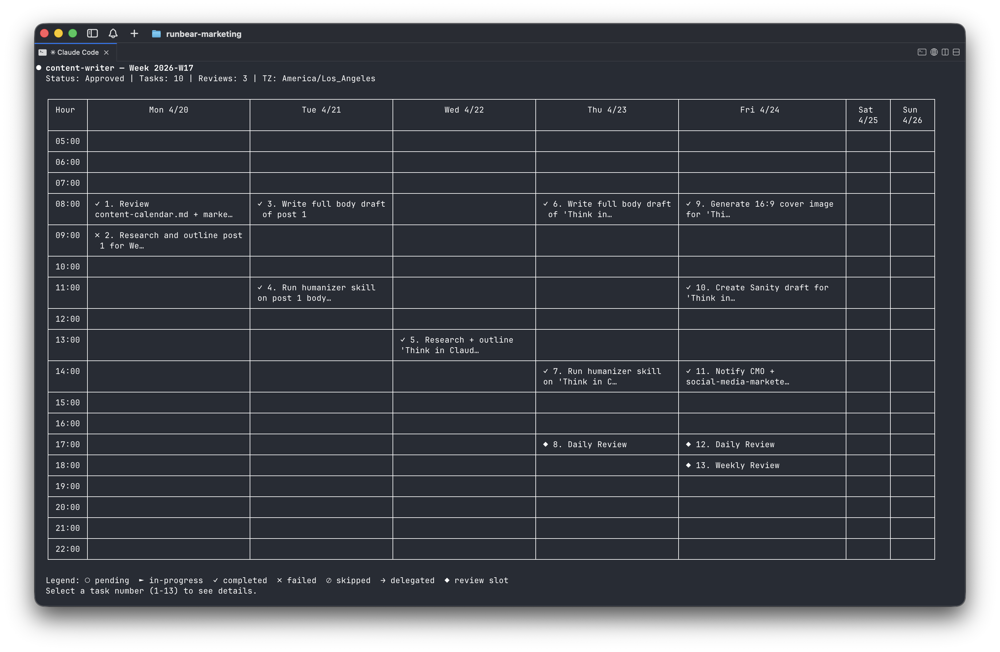

# aweek

<p align="center">
  
</p>

**If Claude Code is the doer, aweek is the planner.**

aweek is a Claude Code plugin for building a team of AI agents that handle the work that repeats. Each agent has a role, a weekly plan, and a token budget. The plan evolves every Monday based on what worked last week. You set direction. Claude Code does the work. aweek runs the week.

> _[60-second demo: Monday's plan based on last week's results → you approve → Friday's status report + next week's draft plan]_

## Why aweek exists

Most AI tools are great at one-off prompts. They're terrible at the work that repeats — the weekly competitive scan, the Monday newsletter, the customer feedback digest, the recurring research memo. That work doesn't need a smarter model. It needs a team that shows up on schedule, remembers what they did last week, and gets a little better each Monday.

aweek is that team.

## Who it's for

- Founders running their own ops who can't keep up with weekly cadence
- Marketers and creators publishing on a schedule (blog → social → newsletter)
- Analysts and researchers running weekly digests, briefs, or memos
- Anyone whose week looks a lot like last week's

## What you can build

| Team | Cadence | What it does |
|---|---|---|
| **Content team** | Publish weekly, distribute daily | 2 blog posts a week, atomized into ~10 social posts, a thread, and a newsletter. Multi-agent handoff: research → draft → editor → distributor. Each week's plan starts from what worked last week. |
| **Competitive intel team** | Brief every Monday | Agents scan ~10 competitors' releases, blogs, pricing, changelogs. Hand back a Monday brief — diffs vs. last week visible at a glance. |
| **Customer feedback team** | Synthesis weekly | Agents read the week's tickets, NPS comments, and call notes. Draft a Friday memo — themes, regressions, top requests, suggested experiments. |

## What you get

| You run | Your team does |
|---|---|
| `/aweek:hire` | Adds an agent — name, role, system prompt |
| `/aweek:plan` | Drafts long-term goals → monthly objectives → weekly tasks. You approve. |
| `/aweek:summary` | Hands in a status report — done, pending, budget left |
| `/aweek:calendar` | Shows the week as an editable calendar grid |
| `/aweek:manage` | Lifecycle ops — pause, resume, top up budget, fire |
| `/aweek:delegate-task` | Drops work into another agent's inbox. Agents hand off to each other. |
| `/aweek:init` | One-time setup — installs the 10-minute heartbeat that wakes every agent |

## Try it in 60 seconds

```bash
/plugin install aweek@runbear-io   # once published
/aweek:init                     # installs heartbeat
/aweek:hire                     # add your first agent
/aweek:plan                     # draft & approve the week
```

Walk away. Come back Monday morning to a status report and next week's draft plan.

## How it works (in 3 lines)

1. **Slash commands** (`/aweek:*`) shell out to a tiny `aweek` CLI for every state change.
2. **Heartbeat** is a 10-minute cron entry per project. It picks the next pending task per agent and runs it in a fresh Claude Code CLI session.
3. **Storage** is plain files: `.aweek/agents/<slug>.json` for scheduling, `.claude/agents/<slug>.md` for identity. No DB.

Every mutation is schema-validated and atomic. **2,000+ tests** guard the data layer.

## Install

aweek ships as a Claude Code plugin. The plugin's `SessionStart` hook installs the `aweek` CLI on first run.

**From a Claude Code marketplace** (when published):
```bash
/plugin install aweek@runbear-io
```

**From source:**
```bash
git clone https://github.com/runbear-io/aweek.git
cd aweek && pnpm install && pnpm link --global
claude --plugin-dir .
```
`/reload-plugins` picks up edits without restarting.

**Requirements:** macOS or Linux, Node.js 20+, `crontab`, `jq`.

## Per-agent secrets

Drop a `.env` file at `.aweek/agents/<slug>/.env` to give one agent its own environment variables. The heartbeat loads it on every tick and passes the values into that agent's Claude Code session — other agents don't see them.

```bash
# .aweek/agents/writer/.env
OPENAI_API_KEY=sk-...
NOTION_TOKEN=secret_...
FEATURE_FLAG=enabled
```

Format is dotenv-style: `KEY=value`, `#` comments, single/double quotes (double-quoted values support `\n \r \t \\ \"`). `.aweek/` is gitignored, so secrets stay out of the repo by default.

## Troubleshooting

- **Slash commands can't find `aweek`.** SessionStart's `npm install -g aweek` failed. Run it yourself.
- **Heartbeat isn't running.** Check `crontab -l` for `# aweek:project-heartbeat:`. If missing, re-run `/aweek:init`.
- **Agent paused.** It hit its weekly budget. `/aweek:manage` → `resume` (resets next week) or `top-up` (resets now).

## Development

```bash
pnpm test          # 2,000+ tests
pnpm lint          # syntax-check src
```

Slash commands call into `src/skills/*.js` via `aweek exec <module> <fn>`. Don't duplicate logic in ad-hoc `node -e` snippets — extend the module and register it in `src/cli/dispatcher.js`.

## License

[Apache 2.0](LICENSE) — © 2026 Runbear, Inc.

---

*Claude Code does the work. aweek runs the week.*
